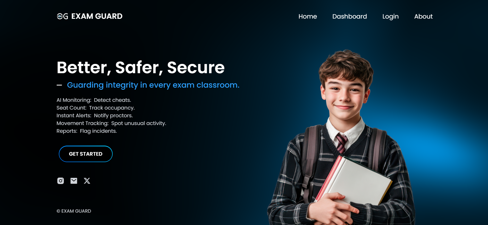
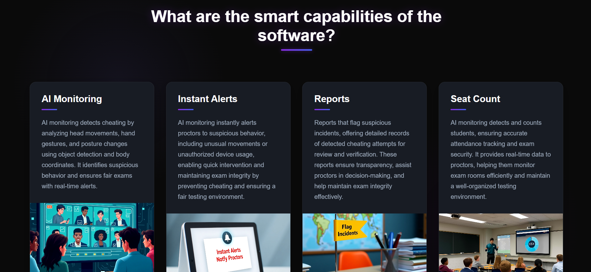
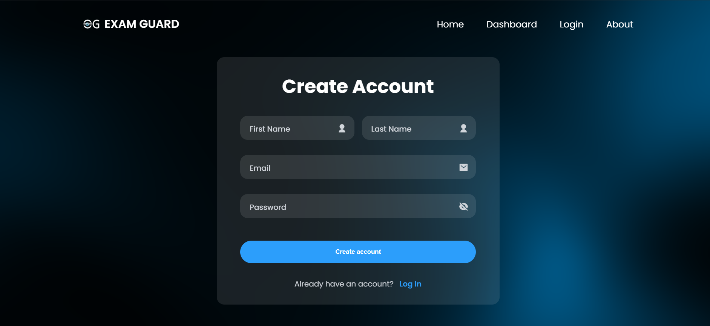
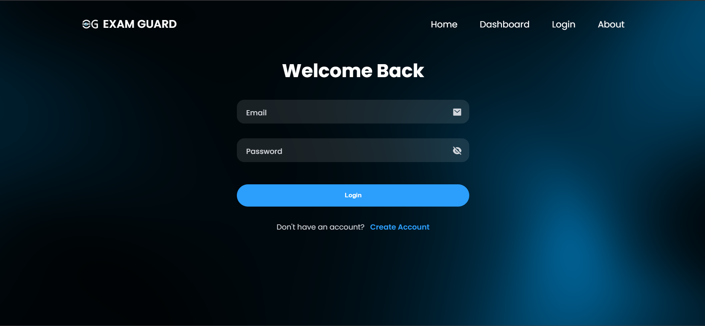
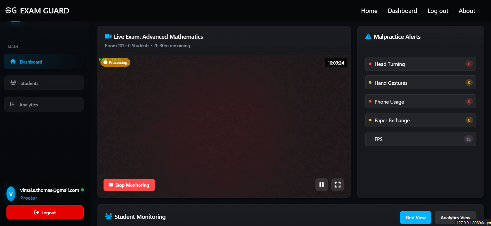
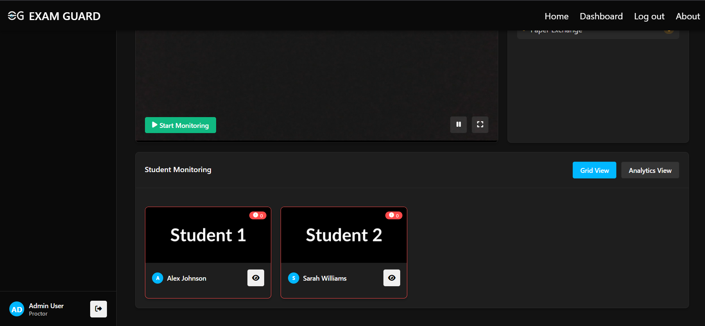
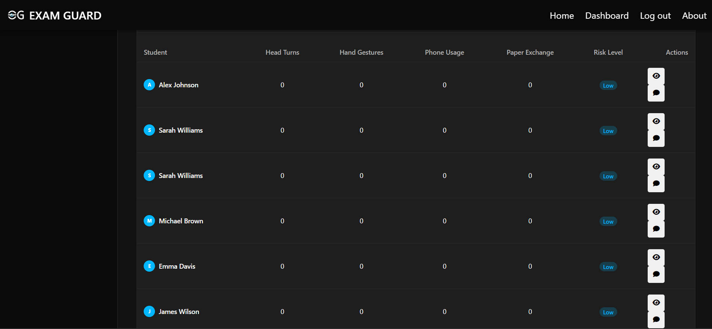
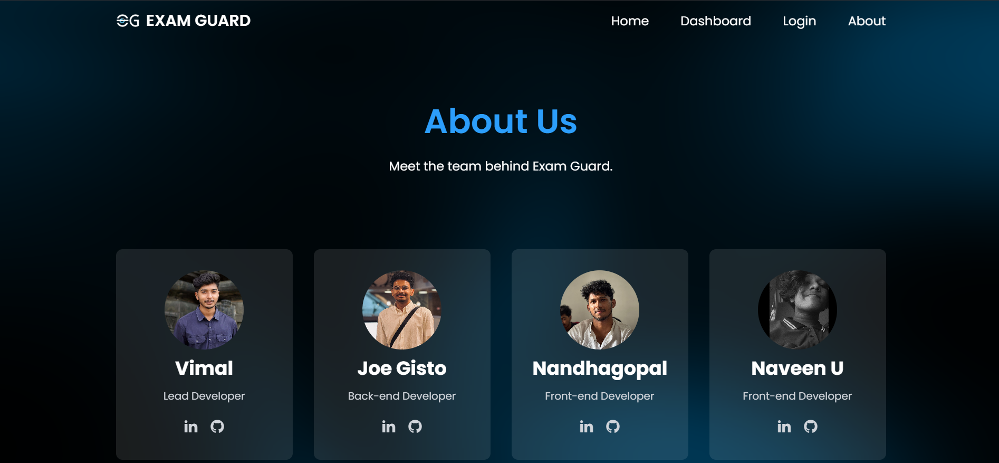

# ExamGuard

ExamGuard is an AI-powered exam proctoring system designed to detect and report malpractice during exams through computer vision and machine learning techniques.

---

## 🧠 Project Overview

ExamGuard uses a combination of YOLOv5s and MediaPipe to detect suspicious activities including:
- Head turning
- Hand gestures
- Phone usage
- Paper exchange

The system captures **snapshot evidence** (not continuous recording), enhancing **privacy** and reducing storage needs.

---

## 🚀 Key Features

- **Real-time Monitoring**
- **Snapshot Evidence Collection**
- **Student Tracking**
- **Dashboard Interface**
- **PDF Report Generation**
- **Firebase Integration**

---

## 🖼️ Frontend Pages

### 🔹 Index Page

### 🔹 About Page

### 🔹 Signup Page

### 🔹 Login Page

### 🔹 Dashboard View

### 🔹 Grid View

### 🔹 Analytical View

### 🔹 Team Page

---

## ⚙️ Technical Architecture

### 🐍 Backend (Python)

- **Flask + Socket.IO** for real-time communication  
- **Firebase** for authentication and storage  
- **OpenCV + MediaPipe + YOLOv5s** for detection and tracking  
- **PDF Reports** using ReportLab

---

## 🧠 AI Models

- **YOLOv5s** for detecting head turns, phone usage, paper exchange  
- **MediaPipe** for face and hand landmarks  

---

## 📈 How It Works

1. Webcam feed is initialized
2. Each frame is analyzed for malpractice
3. On detection:
   - Student is identified and tracked
   - Evidence snapshots are taken
4. A **PDF report** is generated at the end

---

## 📁 Data Storage

- Violations tracked in session memory
- Snapshots saved per session
- JSON + PDF exported at the end

---

## 💾 Requirements

- Python 3.8+
- Flask
- PyTorch
- OpenCV
- MediaPipe
- Firebase Admin SDK
- ReportLab
- Flask-SocketIO

